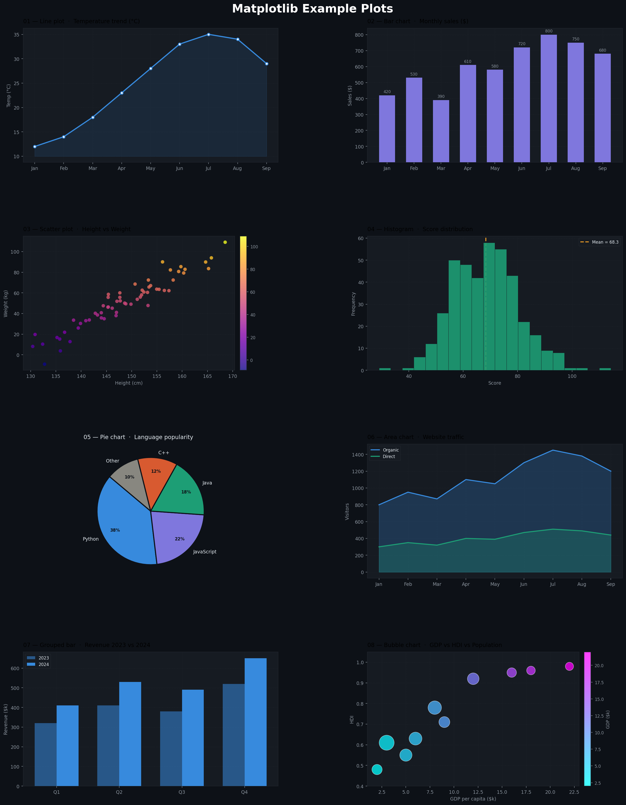

# Matplotlib Visualization — Learning Journal


A progressive, self-documented series of Jupyter Notebooks covering Matplotlib from foundational plots to multi-panel figure management and image visualization. Each notebook documents what I built, the decisions I made, and the visualization principles behind each chart type.

---

## About This Repository

Choosing the wrong chart type is one of the most common mistakes in data communication. This repository is my attempt to understand not just the Matplotlib API, but the reasoning behind each plot — when to use it, what it reveals, and how to configure it for clarity. The notebooks progress from single-axis line plots through histograms, categorical charts, relational plots, subplots, and image rendering.

---

## Notebook Index

| Notebook | Topic | Key Concepts Covered |
|---|---|---|
| `Matplotlib_01_(Line_Plot).ipynb` | Line Plots | `plt.plot()`, markers, linestyle, color, labels, legends |
| `Matplotlib_02_(Histogram).ipynb` | Histograms | `plt.hist()`, bin count, density vs. frequency, cumulative plots |
| `Matplotlib_03_(Part1_Bar_Chart).ipynb` | Bar Charts — Basics | `plt.bar()`, bar width, tick labels, horizontal bars |
| `Matplotlib_04_(Part2_Bar_Chart).ipynb` | Bar Charts — Advanced | Grouped bars, stacked bars, error bars, annotations |
| `Matplotlib_05_(Scatter_Plot).ipynb` | Scatter Plots | `plt.scatter()`, marker size, color mapping, alpha transparency |
| `Matplotlib_06_(Pie_Chart).ipynb` | Pie Charts | `plt.pie()`, explode, autopct, startangle, limitations |
| `Matplotlib_07_(Sub_Plot).ipynb` | Subplots and Layouts | `plt.subplots()`, `fig` and `ax` objects, `tight_layout()`, sharing axes |
| `Matplotlib_08_(Save_Figure).ipynb` | Saving Figures | `savefig()`, DPI, file formats (PNG, PDF, SVG), bbox_inches |
| `Matplotlib_09_(Imshow_&_Colorbar).ipynb` | Image and Color Mapping | `imshow()`, colormaps, `colorbar()`, vmin/vmax, interpolation |

---

## What I Learned

### The Figure and Axes Object Model

Matplotlib operates on two levels: the `Figure` (the entire canvas) and one or more `Axes` objects (the individual plot panels within it). The functional interface (`plt.plot()`) is convenient for single plots but hides this structure. Working directly with `fig, ax = plt.subplots()` makes the object model explicit and is the correct approach for anything beyond a single chart — it gives precise control over each panel, its labels, limits, and ticks independently.

### Choosing the Right Chart

Each plot type answers a different question about the data:

| Chart Type | Best Used When | What It Answers |
|---|---|---|
| Line Plot | Data is ordered or continuous (time, sequence) | How does a value change over a progression? |
| Histogram | Data is numerical and continuous | How is a variable distributed across its range? |
| Bar Chart | Data is categorical | How do discrete groups compare in magnitude? |
| Scatter Plot | Two numerical variables, no implied order | Is there a relationship or correlation between two variables? |
| Pie Chart | A single categorical breakdown, few slices | What proportion does each category represent of a whole? |

Pie charts are the most frequently misused. They become unreadable beyond four or five slices, and human perception of angles is less accurate than perception of length — a bar chart communicates the same information more precisely in almost every case.

### Histograms and Bin Selection

A histogram's shape is sensitive to the number of bins. Too few bins and the distribution appears flat, hiding structure. Too many and random noise dominates. I learned to treat bin count as a parameter to experiment with rather than a fixed choice, and to use `density=True` when comparing distributions of different sample sizes.

### Scatter Plots and Overplotting

When datasets are large, overlapping points make a scatter plot unreadable. The `alpha` parameter (opacity) is the simplest fix — setting it to 0.2 or 0.3 reveals density through layering. For very large datasets, a 2D histogram (`plt.hist2d()`) or a hexbin plot is more informative than a scatter plot.

### Grouped and Stacked Bar Charts

Grouped bar charts compare multiple series side by side across categories. Stacked bar charts show part-to-whole relationships within each category. The key implementation detail is calculating bar positions manually using `np.arange()` and offsetting each group by the bar width — a step that clarified for me how Matplotlib's coordinate system works.

### Subplots and Layout Management

`plt.subplots(nrows, ncols)` returns a Figure and an array of Axes. `tight_layout()` automatically adjusts spacing to prevent labels from overlapping between panels. `sharex` and `sharey` force panels to share axis limits, which is essential when comparing plots that represent the same scale.

### Saving Figures for Different Contexts

`savefig()` accepts `dpi` (dots per inch) and `format` parameters. For presentations and web use, PNG at 150 DPI is sufficient. For print or publication, PDF or SVG should be used as they are vector formats that scale without loss. `bbox_inches='tight'` prevents cropping of axis labels that fall outside the default figure boundary.

### Image Visualization with imshow and Colormaps

`imshow()` renders a 2D array as an image, mapping numerical values to colors through a colormap. The choice of colormap matters: sequential colormaps (like `viridis` or `plasma`) are appropriate for data with a natural order from low to high; diverging colormaps (like `RdBu`) are appropriate when data has a meaningful midpoint, such as zero. `vmin` and `vmax` control how the data range maps to the color scale. A colorbar is always necessary — without it, the color encoding is uninterpretable.

---
## Plots


## Setup and Installation

**Clone the repository**

```bash
git clone https://github.com/abhishekakhand737/MATPLOTLIB.git
cd MATPLOTLIB
```

**Install dependencies**

```bash
pip install matplotlib numpy pandas notebook
```

**Launch Jupyter**

```bash
jupyter notebook
```

---

## Tech Stack

| Tool | Purpose |
|---|---|
| Python 3.x | Runtime environment |
| Matplotlib | Primary plotting and visualization library |
| NumPy | Numerical data generation and array operations |
| Pandas | Structured data handling for plot inputs |
| Jupyter Notebook | Interactive development and inline figure rendering |

---

## Author

**Abhishek Akhand**
B.Tech — Artificial Intelligence and Data Science

GitHub: [abhishekakhand737](https://github.com/abhishekakhand737)

---

*A chart that requires explanation has already failed. The goal is a figure that communicates before it is read.*
